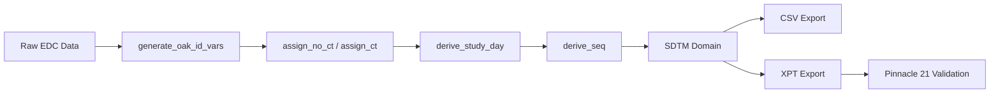

# SDTM Data Transformation with sdtm.oak

## Overview

This directory contains a modern, reproducible SDTM (Study Data Tabulation Model) data transformation pipeline built with the **sdtm.oak** package (v0.2.0) from the pharmaverse ecosystem.

### Implementation Status

| Domain Class | Domain | Status | Script Location |
|-------------|--------|--------|-----------------|
| **Foundation** | DM (Demographics) | ✅ Implemented | `programs/R/oak/foundation/generate_dm_with_oak.R` |
| **Events** | AE (Adverse Events) | ✅ Implemented | `programs/R/oak/events/generate_ae_with_oak.R` |
| **Events** | CM (Concomitant Meds) | 🔵 Planned | `programs/R/oak/events/generate_cm_with_oak.R` |
| **Events** | MH (Medical History) | 🔵 Planned | `programs/R/oak/events/generate_mh_with_oak.R` |
| **Events** | DS (Disposition) | 🔵 Planned | `programs/R/oak/events/generate_ds_with_oak.R` |
| **Events** | EX (Exposure) | 🔵 Planned | `programs/R/oak/events/generate_ex_with_oak.R` |
| **Findings** | VS (Vital Signs) | ✅ Implemented | `programs/R/oak/findings/generate_vs_with_oak.R` |
| **Findings** | LB (Laboratory) | 🔵 Planned | `programs/R/oak/findings/generate_lb_with_oak.R` |
| **Findings** | EG (ECG) | 🔵 Planned | `programs/R/oak/findings/generate_eg_with_oak.R` |
| **Findings** | PE (Physical Exam) | 🔵 Planned | `programs/R/oak/findings/generate_pe_with_oak.R` |
| **Findings About** | QS (Questionnaires) | 🔵 Planned | `programs/R/oak/findings_about/generate_qs_with_oak.R` |
| **Interventions** | SV (Subject Visits) | ⚠️ Not Supported* | - |

*SV and some oncology domains (TU, TR, RS) are not yet supported by sdtm.oak v0.2.0 and require custom development.

## Architecture

### Design Principles

1. **Algorithm-Based Transformation:** Uses reusable sdtm.oak algorithms instead of hard-coded domain-specific logic
2. **Controlled Terminology:** CDISC CT integrated via `config/controlled_terminology.R`
3. **Reproducibility:** All transformations are fully scripted and version-controlled
4. **Testing:** Comprehensive unit tests ensure data quality and SDTM compliance
5. **Modularity:** Each domain is self-contained and can be run independently

### Directory Structure

```
sdtm/
├── programs/
│   ├── R/
│   │   ├── oak/
│   │   │   ├── foundation/          # DM domain
│   │   │   ├── events/              # AE, CM, MH, DS, EX
│   │   │   ├── findings/            # VS, LB, EG, PE
│   │   │   ├── findings_about/      # QS
│   │   │   ├── interventions/       # Future: SV
│   │   │   └── run_all_sdtm_oak.R  # Master orchestration
├── data/
│   ├── csv/                     # SDTM datasets (CSV)
│   └── xpt/                     # SDTM datasets (XPT for submission)
├── logs/                        # Execution logs
├── validation/                  # Pinnacle 21 outputs
├── README.md                    # This file
└── QUICK_START.md               # Getting started guide
```

## Quick Start

See **[QUICK_START.md](QUICK_START.md)** for detailed instructions.

### Minimal Example

```r
# 1. Install dependencies
install.packages(c("sdtm.oak", "pharmaverseraw", "xportr", "dplyr"))

# 2. Run complete pipeline
source("sdtm/programs/R/oak/run_all_sdtm_oak.R")

# 3. Check outputs
list.files("sdtm/data/csv/")   # DM, AE, VS datasets
list.files("sdtm/data/xpt/")   # Regulatory submission files
```

## Key Features

### 1. sdtm.oak Core Functions

| Function | Purpose | Example Usage |
|----------|---------|---------------|
| `generate_oak_id_vars()` | Create unique row identifiers | Required first step for all domains |
| `assign_no_ct()` | Map variables without CT | Verbatim terms, free text fields |
| `assign_ct()` | Map with CDISC CT | Coded variables (SEX, RACE, etc.) |
| `assign_datetime()` | Parse ISO 8601 dates | All date/datetime variables |
| `hardcode_ct()` | Assign fixed CT values | Domain codes, study constants |
| `hardcode_no_ct()` | Assign fixed non-CT values | DOMAIN = "DM" |
| `condition_add()` | Conditional logic | IF-THEN mappings |

### 2. Controlled Terminology Management

All CT specifications follow CDISC standards and are centralized in `config/controlled_terminology.R`:

```r
# Example: Sex CT (C66731)
oak_ct_spec$sex <- tibble(
  codelist_code = c("C66731", "C66731", "C66731"),
  term_code = c("C20197", "C16576", "C17998"),
  term_value = c("M", "F", "U"),
  collected_value = c("Male", "Female", "Unknown"),
  term_preferred_term = c("Male", "Female", "Unknown")
)
```

### 3. Automated Testing

Each domain has comprehensive unit tests:

- **Variable presence:** All required SDTM variables exist
- **Data types:** Numeric, character, date formats validated
- **Controlled terminology:** Values match CDISC CT
- **Cross-domain consistency:** Subject IDs, dates align
- **File outputs:** CSV and XPT files generated

```r
# Run domain-specific tests
testthat::test_file("tests/testthat/test-sdtm-dm.R")
```

### 4. Logging & Monitoring

Detailed execution logs track:
- Domain generation status
- Record counts
- Processing time
- Error messages

Logs saved to: `sdtm/logs/sdtm_oak_pipeline.log`

## Data Flow



## Dependencies

### R Packages

```r
# Core transformation
sdtm.oak          # v0.2.0+
pharmaverseraw    # Sample data
pharmaversesdtm   # Reference datasets

# Data manipulation
dplyr
readr
tibble

# Output generation
xportr            # XPT file creation

# Development
logger            # Execution logging
here              # Path management
testthat          # Unit testing
```

### System Requirements

- R ≥ 4.1.0
- 4GB+ RAM (for typical clinical trial datasets)
- Write permissions for `sdtm/data/` and `sdtm/logs/`

## Validation

### Built-in Quality Checks

1. **Unit Tests:** Automated via testthat (see `tests/testthat/`)
2. **Cross-domain:** Subject ID consistency, date logic
3. **CT Compliance:** All coded values match CDISC specifications

### External Validation

**Pinnacle 21 Community:**
1. Export XPT files: `sdtm/data/xpt/`
2. Run Pinnacle 21 validator
3. Review conformance report
4. Address issues and re-run pipeline

See `sdtm/validation/` for validation artifacts.

## Customization

### Adding New Domains

1. **Create domain script:**
   ```bash
   touch sdtm/programs/R/oak/events/generate_cm_with_oak.R
   ```

2. **Use template structure:**
   - Load raw data
   - Generate oak IDs
   - Apply assign_ct/assign_no_ct
   - Derive variables (study day, sequence)
   - Export CSV and XPT

3. **Add to orchestration:**
   Edit `run_all_sdtm_oak.R` to include new domain

4. **Create unit tests:**
   ```bash
   touch tests/testthat/test-sdtm-cm.R
   ```

### Using Custom Raw Data

Replace `pharmaverseraw` data sources:

```r
# In domain script:
# dm_raw <- pharmaverseraw::dm_raw

# Replace with:
dm_raw <- readr::read_csv(file.path(PATH_RAW_DATA, "my_dm_data.csv"))
```

Ensure variable names match expected format or add mapping step.

## Known Limitations

1. **Study day derivation:** Currently uses placeholder logic; requires integration with DM RFSTDTC for production use
2. **MedDRA/WHODrug coding:** Not automated; requires external coding process
3. **Oncology domains (TU, TR, RS):** Not supported by sdtm.oak v0.2.0
4. **Trial design domains:** Not yet implemented (TV, TE, TA, etc.)
5. **RELREC relationships:** Manual specification required

## Roadmap

### Phase 1: Core Domains (Current)
- [x] DM (Demographics)
- [x] VS (Vital Signs)
- [x] AE (Adverse Events)
- [x] Unit testing framework
- [x] Master orchestration script

### Phase 2: Extended Coverage (Q1 2025)
- [ ] CM (Concomitant Medications)
- [ ] LB (Laboratory Results)
- [ ] EG (ECG)
- [ ] MH (Medical History)
- [ ] DS (Disposition)
- [ ] EX (Exposure)

### Phase 3: Advanced Features (Q2 2025)
- [ ] QS (Questionnaires)
- [ ] PE (Physical Examination)
- [ ] define.xml generation
- [ ] aCRF reconciliation
- [ ] CI/CD integration

### Phase 4: Production Deployment (Q3 2025)
- [ ] EDC integration (Medidata Rave, Veeva Vault)
- [ ] Automated Pinnacle 21 validation
- [ ] Data lineage documentation
- [ ] Regulatory submission package

## Contributing

Contributions welcome! Please:

1. Fork the repository
2. Create feature branch (`feature/new-domain`)
3. Follow existing code style and structure
4. Add unit tests for new domains
5. Update documentation
6. Submit pull request

## Support

- **Issues:** [GitHub Issues](https://github.com/stiigg/sas-r-hybrid-clinical-pipeline/issues)
- **Questions:** [pharmaverse Slack](https://pharmaverse.slack.com)
- **Documentation:** [sdtm.oak website](https://pharmaverse.github.io/sdtm.oak/)

## References

1. **sdtm.oak Package:** https://pharmaverse.github.io/sdtm.oak/
2. **CDISC SDTM IG:** https://www.cdisc.org/standards/foundational/sdtmig
3. **Pharmaverse:** https://pharmaverse.org/
4. **R/Pharma 2024 Workshop:** [sdtm.oak Tutorial](https://github.com/pharmaverse/rinpharma-2024-SDTM-workshop)
5. **Atorus Research Blog:** [Automating SDTM with sdtm.oak](https://www.atorusresearch.com/resources/automating-your-sdtm-programming-with-sdtm-oak/)

## License

MIT License - see repository root for details

---

**Last Updated:** 2024-12-24  
**sdtm.oak Version:** 0.2.0  
**Maintainer:** Christian Baghai (@stiigg)
